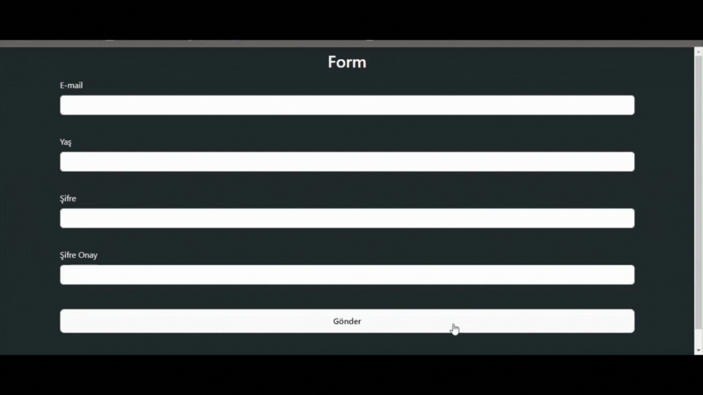

- Bu proje, formik ve yup kütüphanelerini kullanarak form yönetimi ve doğrulama işlemlerini gerçekleştiren bir React uygulamasıdır. formik form durumlarını yönetmek için kullanılırken, yup kütüphanesi form verilerinin doğrulamasını yapmak için kullanılır. Ayrıca, bazı giriş alanları için özel regex doğrulamaları yapılmaktadır.

## ScreenCast

